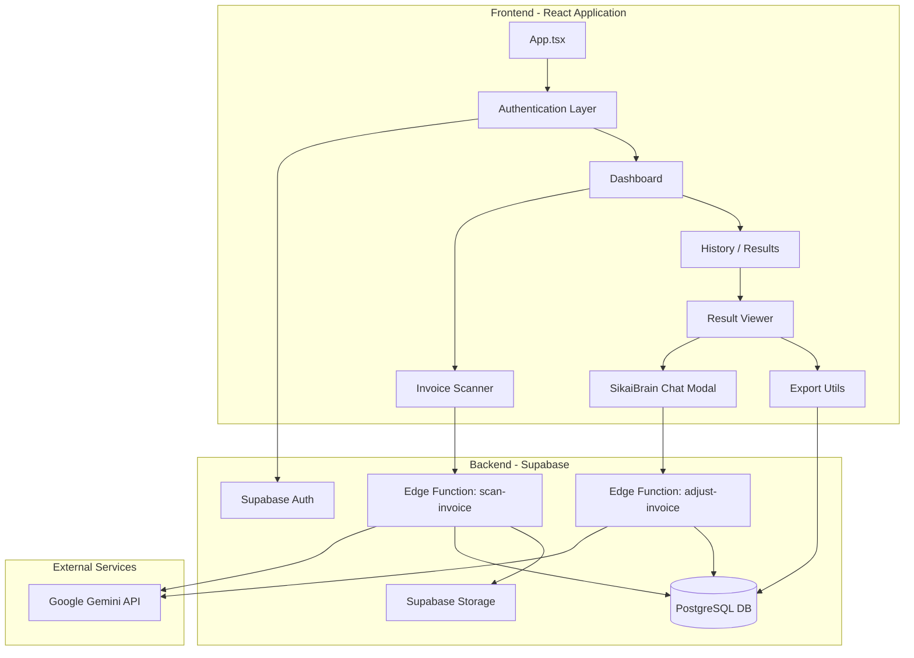
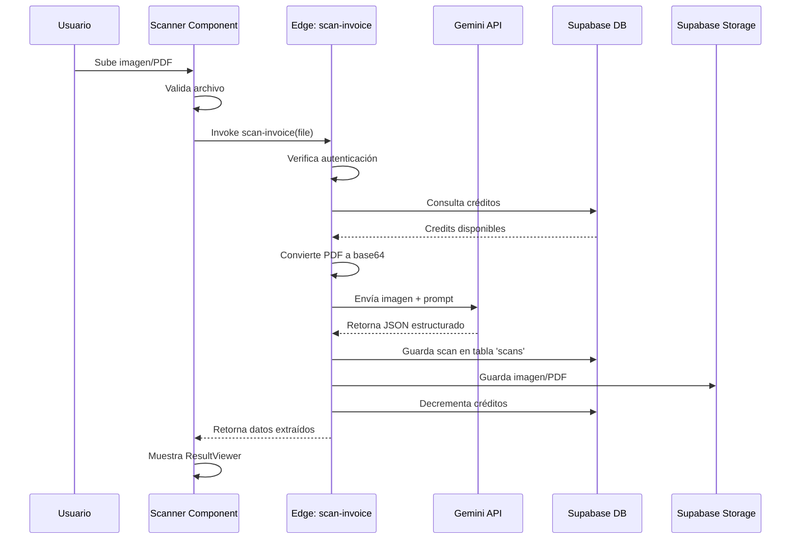
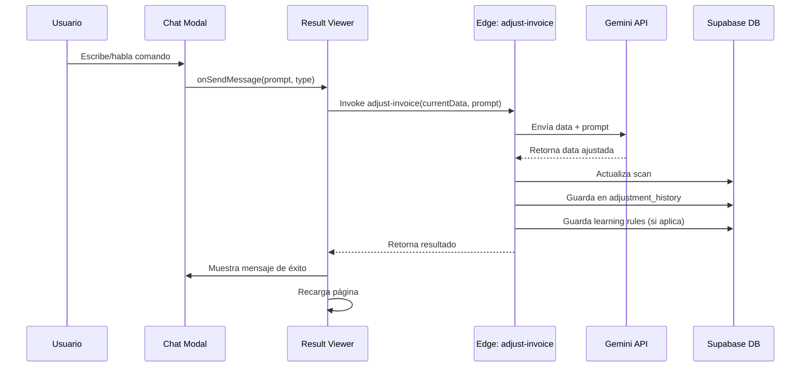
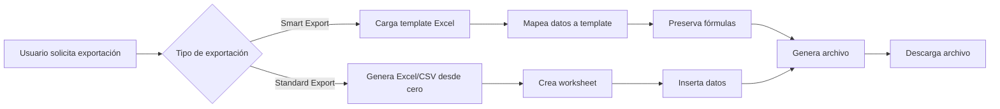
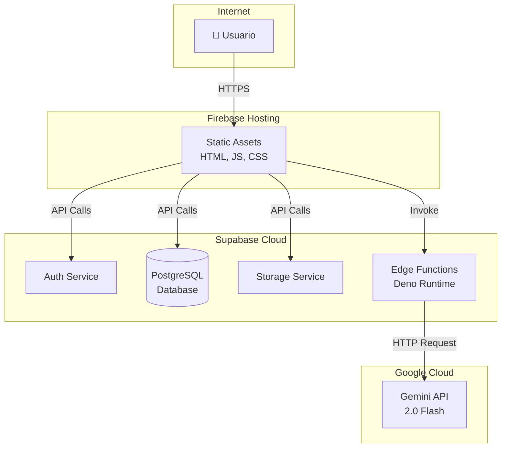

# SIKAI Invoice Portal - Arquitectura del Sistema

## 📋 Tabla de Contenidos
1. [Resumen Ejecutivo](#resumen-ejecutivo)
2. [Stack Tecnológico](#stack-tecnológico)
3. [Arquitectura de Componentes](#arquitectura-de-componentes)
4. [Flujo de Datos](#flujo-de-datos)
5. [Arquitectura de Despliegue](#arquitectura-de-despliegue)
6. [Seguridad](#seguridad)

---

## Resumen Ejecutivo

**SIKAI Invoice Portal** es una aplicación web moderna para el escaneo, procesamiento y gestión de facturas mediante IA. La aplicación permite a los usuarios:
- Escanear facturas desde imágenes o PDFs
- Extraer datos estructurados con Google Gemini AI
- Ajustar facturas mediante comandos de texto o voz
- Exportar datos a Excel con templates personalizados
- Gestionar categorías y aprender preferencias del usuario

---

## Stack Tecnológico

### Frontend
```yaml
Framework: React 18 + TypeScript
Build Tool: Vite 7.3.1
Styling: TailwindCSS
Icons: Lucide React
State Management: React Context API
Routing: Wouter
```

### Backend & Infrastructure
```yaml
Backend-as-a-Service: Supabase
  - Authentication: Supabase Auth
  - Database: PostgreSQL
  - Storage: Supabase Storage
  - Edge Functions: Deno Runtime
AI/ML: Google Gemini 2.0 Flash
Hosting: Firebase Hosting
Version Control: GitHub
```

### Key Libraries
```yaml
PDF Processing: PDF.js
Excel Export: SheetJS (xlsx)
Speech Recognition: Web Speech API
File Processing: FileReader API
```

---

## Arquitectura de Componentes



### Componentes Principales

#### 1. **Authentication Layer** (`auth.tsx`)
- Gestión de sesiones con Supabase Auth
- Protección de rutas
- Manejo de créditos del usuario

#### 2. **Dashboard** (`Dashboard.tsx`)
- Vista principal post-login
- KPIs y estadísticas
- Navegación a Scanner e Historial

#### 3. **Invoice Scanner** (`InvoiceScanner.tsx`)
- Upload de imágenes/PDFs
- Captura desde cámara
- Invocación de `scan-invoice` Edge Function

#### 4. **Result Viewer** (`ResultViewer.tsx`)
- Visualización de datos extraídos
- Integración con SikaiBrain Chat
- Ajustes mediante IA
- Exportación a Excel

#### 5. **SikaiBrain Chat Modal** (`SikaiBrainChatModal.tsx`)
- Interfaz de chat con IA
- Entrada de texto y voz
- Historial de conversación
- Estados: idle, listening, processing

#### 6. **Edge Functions**
- **scan-invoice**: Procesa PDFs/imágenes con Gemini, extrae datos
- **adjust-invoice**: Ajusta facturas existentes según comandos del usuario

---

## Flujo de Datos

### 1. Flujo de Escaneo de Factura



### 2. Flujo de Ajuste con SikaiBrain



### 3. Flujo de Exportación



---

## Arquitectura de Despliegue



### Configuración de Despliegue

**Frontend (Firebase)**:
- **URL**: https://sikai-invoice-app.web.app
- **CDN**: Firebase CDN global
- **Deploy**: `firebase deploy`

**Backend (Supabase)**:
- **Project**: eimpxyqxopfticglxhqt
- **Region**: us-east-1
- **Edge Functions Deploy**: `npx supabase functions deploy`

**Variables de Entorno**:
```env
VITE_SUPABASE_URL=https://eimpxyqxopfticglxhqt.supabase.co
VITE_SUPABASE_ANON_KEY=<anon_key>
GEMINI_API_KEY=<api_key>  # Server-side only
```

---

## Seguridad

### Autenticación y Autorización

**Supabase Auth**:
- JWT-based authentication
- Session management
- Secure token storage

**Row Level Security (RLS)**:
```sql
-- Ejemplo: Solo el usuario puede ver sus scans
CREATE POLICY "Users can view own scans"
ON scans FOR SELECT
USING (auth.uid() = user_id);
```

### API Security

**Edge Functions**:
- Verificación de autenticación en cada request
- Validación de entrada
- Rate limiting via créditos
- API keys en variables de entorno

**CORS**:
```typescript
const corsHeaders = {
  'Access-Control-Allow-Origin': '*',
  'Access-Control-Allow-Headers': 'authorization, x-client-info, apikey, content-type',
}
```

### Data Security

**Sensitive Data**:
- Gemini API Key: Server-side only (Edge Functions)
- User credentials: Handled by Supabase Auth
- File uploads: Validated (MIME type, size)

**Storage**:
- Files stored in Supabase Storage buckets
- Access controlled via RLS policies
- URLs expire based on policy

---

## Performance & Scalability

### Optimizaciones Frontend
- Code splitting con Vite
- Lazy loading de componentes
- Memoización de componentes pesados
- Optimización de re-renders

### Optimizaciones Backend
- Edge Functions con Deno (fast cold starts)
- Database indexing en campos frecuentes
- Connection pooling en PostgreSQL
- CDN para assets estáticos

### Límites y Cuotas
```yaml
Gemini API:
  - Max tokens: 32,768 output tokens
  - Rate limit: Based on API tier
  
Supabase:
  - Database: PostgreSQL limits
  - Storage: Based on plan
  - Edge Functions: 500ms timeout (configurable)
```

---

## Monitoreo y Logging

### Frontend Logging
```typescript
console.log('[ComponentName] Action:', data);
console.error('[ComponentName] Error:', error, context);
```

### Backend Logging
- Edge Function logs en Supabase Dashboard
- Error tracking en console
- Request/Response logging para debugging

---

## Próximas Mejoras

1. **Persistencia de Chat**: Guardar historial de conversaciones
2. **Webhooks**: Notificaciones de procesamiento asíncrono
3. **Multi-tenancy**: Soporte para múltiples organizaciones
4. **Analytics**: Dashboard de uso y métricas
5. **Mobile App**: Versión nativa para iOS/Android

---

**Versión**: 1.0  
**Última Actualización**: 2026-01-27  
**Autor**: SIKAI CX Team
