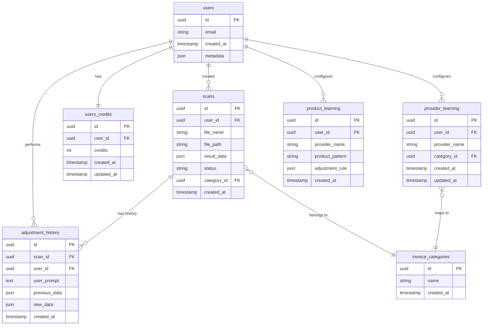

# SIKAI Invoice Portal - Documentación de Base de Datos

## 📋 Tabla de Contenidos
1. [Diagrama Entidad-Relación](#diagrama-entidad-relación)
2. [Tablas del Sistema](#tablas-del-sistema)
3. [Relaciones](#relaciones)
4. [Políticas RLS](#políticas-rls)
5. [Índices y Optimizaciones](#índices-y-optimizaciones)

---

## Diagrama Entidad-Relación



---

## Tablas del Sistema

### 1. `users` (Supabase Auth)
**Descripción**: Tabla gestionada por Supabase Auth para autenticación de usuarios.

| Campo | Tipo | Descripción |
|-------|------|-------------|
| `id` | uuid | PK - ID único del usuario |
| `email` | varchar | Email del usuario |
| `encrypted_password` | varchar | Password encriptada |
| `created_at` | timestamptz | Fecha de creación |
| `email_confirmed_at` | timestamptz | Confirmación de email |
| `last_sign_in_at` | timestamptz | Último login |

**Políticas RLS**: Gestionadas por Supabase Auth

---

### 2. `users_credits`
**Descripción**: Gestión de créditos por usuario para escaneo de facturas.

| Campo | Tipo | Constraints | Descripción |
|-------|------|-------------|-------------|
| `id` | uuid | PK, DEFAULT uuid_generate_v4() | ID único |
| `user_id` | uuid | FK → users.id, UNIQUE | Referencia al usuario |
| `credits` | integer | NOT NULL, DEFAULT 0 | Créditos disponibles |
| `created_at` | timestamptz | DEFAULT now() | Fecha de creación |
| `updated_at` | timestamptz | DEFAULT now() | Última actualización |

**Relaciones**:
- `user_id` → `auth.users.id` (ONE-TO-ONE)

**Uso**:
- Se consulta antes de cada escaneo
- Se decrementa en 1 por cada escaneo exitoso
- Se incrementa al comprar créditos

---

### 3. `scans`
**Descripción**: Almacena resultados de escaneo de facturas.

| Campo | Tipo | Constraints | Descripción |
|-------|------|-------------|-------------|
| `id` | uuid | PK, DEFAULT uuid_generate_v4() | ID único del scan |
| `user_id` | uuid | FK → users.id, NOT NULL | Usuario propietario |
| `file_name` | varchar | NOT NULL | Nombre del archivo |
| `file_path` | text | NULL | Ruta en Supabase Storage |
| `result_data` | jsonb | NULL | Datos extraídos de la factura |
| `status` | varchar | DEFAULT 'completed' | Estado del procesamiento |
| `category_id` | uuid | FK → invoice_categories.id | Categoría asignada |
| `created_at` | timestamptz | DEFAULT now() | Fecha de creación |

**Estructura de `result_data` (JSONB)**:
```json
{
  "date": "2026-01-27",
  "invoice_number": "FE363690",
  "provider_name": "LISSIA",
  "nit": "79421317-3",
  "total_amount": 45600,
  "iva_amount": 7200,
  "subtotal": 38400,
  "items": [
    {
      "code": "001",
      "description": "Producto X",
      "quantity": 2,
      "unit_price": 10000,
      "tax_rate": "19%",
      "total": 20000
    }
  ]
}
```

**Relaciones**:
- `user_id` → `users.id` (MANY-TO-ONE)
- `category_id` → `invoice_categories.id` (MANY-TO-ONE)

---

### 4. `adjustment_history`
**Descripción**: Historial de ajustes realizados a facturas mediante SikaiBrain con almacenamiento optimizado.

| Campo | Tipo | Constraints | Descripción |
|-------|------|-------------|-------------|
| `id` | uuid | PK, DEFAULT uuid_generate_v4() | ID único |
| `scan_id` | uuid | FK → scans.id, NOT NULL | Factura ajustada |
| `user_id` | uuid | FK → users.id, NOT NULL | Usuario que hizo el ajuste |
| `user_prompt` | text | NOT NULL | Comando de voz/texto |
| `change_delta` | jsonb | NULL | **OPTIMIZADO**: Solo cambios (ahorro 80-95%) |
| `previous_data` | jsonb | NULL | Datos antes del ajuste (legacy/backup) |
| `new_data` | jsonb | NULL | DEPRECADO: Usar delta |
| `created_at` | timestamptz | DEFAULT now() | Timestamp del ajuste |

**Estructura de `change_delta` (JSONB) - Delta Encoding**:
```json
{
  "changes": [
    {
      "type": "item_update",
      "index": 42,
      "code": "P001",
      "description": "CERVEZA POKER",
      "changes": {
        "unit_price": { "old": 4500, "new": 5000 },
        "total": { "old": 9000, "new": 10000 }
      }
    },
    {
      "type": "field_updates",
      "changes": {
        "total_amount": { "old": 45600, "new": 46600 }
      }
    }
  ],
  "total_changes": 2,
  "timestamp": "2026-01-28T09:23:00Z"
}
```

**Tipos de cambios en delta**:
- `item_update`: Modificación de un item existente
- `item_add`: Nuevo item agregado
- `item_delete`: Item eliminado
- `field_updates`: Cambios en campos de cabecera (proveedor, totales, etc.)

**Relaciones**:
- `scan_id` → `scans.id` (MANY-TO-ONE)
- `user_id` → `users.id` (MANY-TO-ONE)

**Uso**:
- Se crea un registro por cada ajuste exitoso
- Permite auditoría completa de cambios
- **OPTIMIZACIÓN**: Solo se guarda el delta (cambios), no todo el documento
- Reconstrucción: original_data + aplicar todos los deltas en orden
- Muestra diferencias en UI (tab "Historial de Cambios")

**Ahorro de Storage**:
- Factura típica de 100 items: ~50KB
- Delta promedio: ~0.5-2KB (99% de ahorro)
- Para 1000 ajustes/mes: 2MB vs 100MB (98% menos)

---

### 5. `invoice_categories`
**Descripción**: Categorías de facturas definidas por el usuario.

| Campo | Tipo | Constraints | Descripción |
|-------|------|-------------|-------------|
| `id` | uuid | PK, DEFAULT uuid_generate_v4() | ID único |
| `name` | varchar | NOT NULL, UNIQUE | Nombre de la categoría |
| `created_at` | timestamptz | DEFAULT now() | Fecha de creación |

**Ejemplos**:
- Licorera
- Ferretería
- Supermercado
- Farmacia

**Uso**:
- El usuario crea categorías personalizadas
- Se asigna automáticamente según `provider_learning`
- Se usa para exportación inteligente (smart export)

---

### 6. `provider_learning`
**Descripción**: Mapeo de proveedores a categorías para auto-clasificación.

| Campo | Tipo | Constraints | Descripción |
|-------|------|-------------|-------------|
| `id` | uuid | PK, DEFAULT uuid_generate_v4() | ID único |
| `user_id` | uuid | FK → users.id, NOT NULL | Usuario propietario |
| `provider_name` | varchar | NOT NULL | Nombre del proveedor |
| `category_id` | uuid | FK → invoice_categories.id | Categoría asignada |
| `created_at` | timestamptz | DEFAULT now() | Fecha de creación |
| `updated_at` | timestamptz | DEFAULT now() | Última actualización |

**Constraints adicionales**:
- `UNIQUE(user_id, provider_name)` - Un proveedor solo puede tener una categoría por usuario

**Relaciones**:
- `user_id` → `users.id` (MANY-TO-ONE)
- `category_id` → `invoice_categories.id` (MANY-TO-ONE)

**Uso**:
- Al escanear una factura de "LISSIA", si existe un registro con `provider_name='LISSIA'`, se asigna automáticamente la categoría
- Se actualiza cuando el usuario cambia la categoría en `InvoiceDetails`

---

### 7. `product_learning`
**Descripción**: Reglas de ajuste automático aprendidas de comandos de voz.

| Campo | Tipo | Constraints | Descripción |
|-------|------|-------------|-------------|
| `id` | uuid | PK, DEFAULT uuid_generate_v4() | ID único |
| `user_id` | uuid | FK → users.id, NOT NULL | Usuario propietario |
| `provider_name` | varchar | NOT NULL | Proveedor asociado |
| `product_pattern` | varchar | NOT NULL | Patrón de producto (ej: "oro") |
| `adjustment_rule` | jsonb | NOT NULL | Regla de transformación |
| `created_at` | timestamptz | DEFAULT now() | Fecha de creación |

**Estructura de `adjustment_rule` (JSONB)**:
```json
{
  "action": "replace",
  "field": "description",
  "pattern": "Esm.l.oro",
  "replacement": "ESMALTE LIGNE D'OR",
  "context": "Cambia esmalte oro por ESMALTE LIGNE D'OR"
}
```

**Relaciones**:
- `user_id` → `users.id` (MANY-TO-ONE)

**Uso**:
- Se crea cuando SikaiBrain detecta un patrón reutilizable
- Permite aplicar ajustes automáticos en futuros escaneos
- Ejemplo: "Cuando veas 'Esm.l.oro', siempre reemplázalo por 'ESMALTE LIGNE D'OR'"

---

## Relaciones

### Resumen de Relaciones

```
users (1) ←→ (1) users_credits
users (1) ←→ (∞) scans
users (1) ←→ (∞) adjustment_history
users (1) ←→ (∞) provider_learning
users (1) ←→ (∞) product_learning

scans (1) ←→ (∞) adjustment_history
scans (∞) ←→ (1) invoice_categories

provider_learning (∞) ←→ (1) invoice_categories
```

### Integridad Referencial

Todas las foreign keys tienen:
- `ON DELETE CASCADE` - Al eliminar un usuario, se eliminan sus datos
- `ON UPDATE CASCADE` - Actualizaciones en cascada

---

## Políticas RLS

### Habilitación de RLS
```sql
ALTER TABLE scans ENABLE ROW LEVEL SECURITY;
ALTER TABLE users_credits ENABLE ROW LEVEL SECURITY;
ALTER TABLE adjustment_history ENABLE ROW LEVEL SECURITY;
ALTER TABLE provider_learning ENABLE ROW LEVEL SECURITY;
ALTER TABLE product_learning ENABLE ROW LEVEL SECURITY;
ALTER TABLE invoice_categories ENABLE ROW LEVEL SECURITY;
```

### Políticas por Tabla

#### `users_credits`
```sql
-- Lectura: Solo el propio usuario
CREATE POLICY "Users can view own credits"
ON users_credits FOR SELECT
USING (auth.uid() = user_id);

-- Actualización: Solo el propio usuario
CREATE POLICY "Users can update own credits"
ON users_credits FOR UPDATE
USING (auth.uid() = user_id);
```

#### `scans`
```sql
-- Lectura: Solo propios scans
CREATE POLICY "Users can view own scans"
ON scans FOR SELECT
USING (auth.uid() = user_id);

-- Inserción: Solo para el propio usuario
CREATE POLICY "Users can insert own scans"
ON scans FOR INSERT
WITH CHECK (auth.uid() = user_id);

-- Actualización: Solo propios scans
CREATE POLICY "Users can update own scans"
ON scans FOR UPDATE
USING (auth.uid() = user_id);
```

#### `adjustment_history`
```sql
-- Lectura: Solo propios ajustes
CREATE POLICY "Users can view own history"
ON adjustment_history FOR SELECT
USING (auth.uid() = user_id);

-- Inserción: Solo para el propio usuario
CREATE POLICY "Users can insert own history"
ON adjustment_history FOR INSERT
WITH CHECK (auth.uid() = user_id);
```

#### `provider_learning` & `product_learning`
```sql
-- Similar a las anteriores: Solo acceso a propios datos
CREATE POLICY "Users can manage own learning"
ON provider_learning FOR ALL
USING (auth.uid() = user_id);

CREATE POLICY "Users can manage own product rules"
ON product_learning FOR ALL
USING (auth.uid() = user_id);
```

#### `invoice_categories`
```sql
-- Lectura: Todos los usuarios autenticados
CREATE POLICY "Authenticated users can view categories"
ON invoice_categories FOR SELECT
TO authenticated
USING (true);

-- Inserción: Todos los usuarios autenticados
CREATE POLICY "Authenticated users can create categories"
ON invoice_categories FOR INSERT
TO authenticated
WITH CHECK (true);
```

---

## Índices y Optimizaciones

### Índices Recomendados

```sql
-- Búsquedas frecuentes por user_id
CREATE INDEX idx_scans_user_id ON scans(user_id);
CREATE INDEX idx_adjustment_history_user_id ON adjustment_history(user_id);
CREATE INDEX idx_adjustment_history_scan_id ON adjustment_history(scan_id);
CREATE INDEX idx_provider_learning_user_provider ON provider_learning(user_id, provider_name);

-- Búsquedas por fecha
CREATE INDEX idx_scans_created_at ON scans(created_at DESC);
CREATE INDEX idx_adjustment_history_created_at ON adjustment_history(created_at DESC);

-- Búsquedas en JSONB
CREATE INDEX idx_scans_result_data_gin ON scans USING gin(result_data);
```

### Optimizaciones de Consultas

**Consulta de historial con filtros**:
```sql
-- Eficiente: Usa índice en user_id y created_at
SELECT * FROM scans
WHERE user_id = 'uuid-here'
ORDER BY created_at DESC
LIMIT 50;
```

**Búsqueda en result_data**:
```sql
-- Usa índice GIN
SELECT * FROM scans
WHERE result_data @> '{"provider_name": "LISSIA"}';
```

---

## Estadísticas y Monitoreo

### Consultas de Estadísticas

**Total de escaneos por usuario**:
```sql
SELECT user_id, COUNT(*) as total_scans
FROM scans
GROUP BY user_id;
```

**Créditos restantes**:
```sql
SELECT u.email, uc.credits
FROM users u
JOIN users_credits uc ON u.id = uc.user_id
ORDER BY uc.credits ASC;
```

**Categorías más usadas**:
```sql
SELECT c.name, COUNT(s.id) as usage_count
FROM invoice_categories c
LEFT JOIN scans s ON c.id = s.category_id
GROUP BY c.id, c.name
ORDER BY usage_count DESC;
```

---

## Migración y Respaldo

### Backup
```bash
# Backup completo vía Supabase CLI
npx supabase db dump > backup.sql

# Backup solo datos
npx supabase db dump --data-only > backup-data.sql
```

### Restore
```bash
psql -h <host> -U <user> -d <database> < backup.sql
```

---

**Versión**: 1.0  
**Última Actualización**: 2026-01-27  
**Motor**: PostgreSQL 15.x (Supabase)
