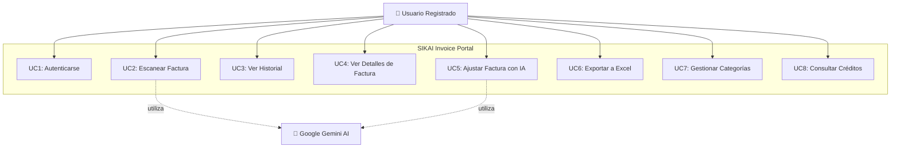
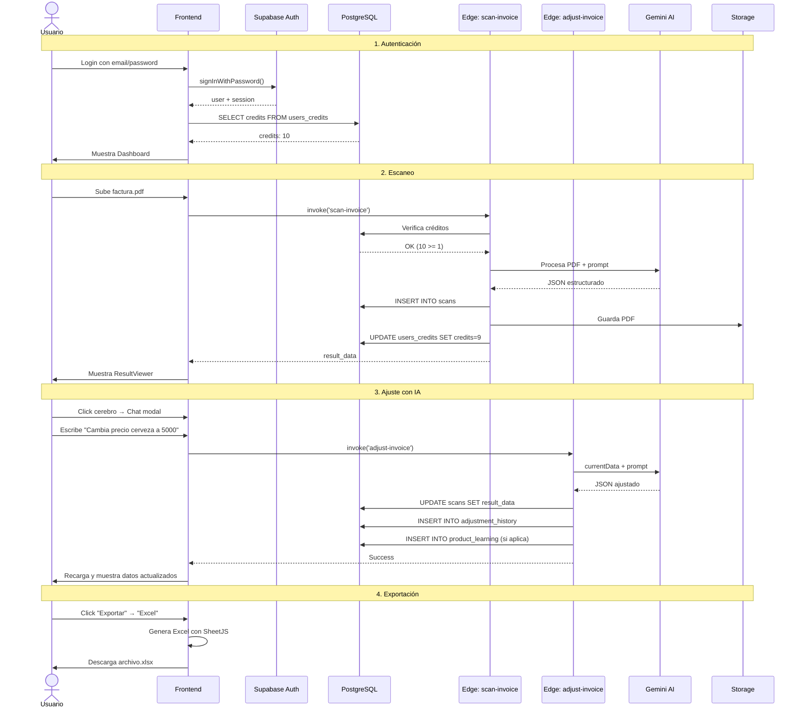

# SIKAI Invoice Portal - Casos de Uso

## 📋 Tabla de Contenidos
1. [Diagrama de Casos de Uso](#diagrama-de-casos-de-uso)
2. [Actores del Sistema](#actores-del-sistema)
3. [Casos de Uso Principales](#casos-de-uso-principales)
4. [Flujos Detallados](#flujos-detallados)

---

## Diagrama de Casos de Uso



---

## Actores del Sistema

### 👤 Usuario Registrado
**Descripción**: Usuario autenticado que tiene créditos disponibles para escanear facturas.

**Responsabilidades**:
- Escanear facturas (imágenes/PDFs)
- Ajustar datos extraídos mediante comandos
- Exportar datos a Excel
- Gestionar categorías de facturas
- Consultar su historial

---

### 🤖 Google Gemini AI (Sistema Externo)
**Descripción**: Servicio de IA de Google para procesamiento de documentos.

**Responsabilidades**:
- Extraer datos estructurados de imágenes/PDFs
- Interpretar comandos de ajuste en lenguaje natural
- Aplicar transformaciones a datos existentes

---

## Casos de Uso Principales

### UC1: Autenticarse

**Actor**: Usuario  
**Precondiciones**: El usuario tiene una cuenta registrada  
**Postcondiciones**: El usuario accede al sistema con sesión activa

**Flujo Principal**:
1. Usuario ingresa email y contraseña
2. Sistema valida credenciales con Supabase Auth
3. Sistema carga créditos disponibles
4. Sistema redirige a Dashboard
5. Usuario visualiza sus estadísticas

**Flujos Alternativos**:
- **1a. Credenciales incorrectas**: Sistema muestra error
- **1b. Usuario no confirmado**: Sistema solicita confirmación de email

---

### UC2: Escanear Factura

**Actor**: Usuario  
**Precondiciones**: 
- Usuario autenticado
- Usuario tiene créditos disponibles (≥1)

**Postcondiciones**: 
- Factura procesada y guardada
- Créditos decrementados en 1
- Datos extraídos disponibles

**Flujo Principal**:
1. Usuario navega a "Scanner"
2. Usuario selecciona archivo (imagen/PDF) o captura con cámara
3. Sistema valida formato y tamaño
4. Usuario hace clic en "Escanear"
5. Sistema invoca Edge Function `scan-invoice`
6. Edge Function verifica créditos disponibles
7. Edge Function convierte archivo a base64
8. Edge Function envía a Gemini AI con prompt estructurado
9. Gemini AI procesa y retorna JSON con datos estructurados
10. Edge Function guarda resultado en tabla `scans`
11. Edge Function guarda archivo en Storage
12. Edge Function decrementa créditos
13. Sistema muestra ResultViewer con datos extraídos

**Flujos Alternativos**:
- **6a. Sin créditos**: Sistema muestra mensaje "Créditos insuficientes"
- **9a. PDF muy grande**: Sistema muestra error de tamaño (>32KB respuesta)
- **9b. Gemini AI no disponible**: Sistema muestra error de servicio

**Flujos Excepcionales**:
- **E1. Error de red**: Sistema muestra error y permite reintentar
- **E2. Archivo corrupto**: Sistema rechaza archivo con mensaje claro

---

### UC3: Ver Historial

**Actor**: Usuario  
**Precondiciones**: Usuario autenticado

**Postcondiciones**: Usuario visualiza lista de facturas escaneadas

**Flujo Principal**:
1. Usuario navega a "Historial"
2. Sistema carga facturas desde tabla `scans` (ORDER BY created_at DESC)
3. Sistema muestra lista con preview de cada factura
4. Usuario puede buscar por nombre de archivo
5. Usuario puede filtrar (futuro: por fecha, categoría)

**Flujos Alternativos**:
- **2a. Sin facturas**: Sistema muestra estado vacío con CTA "Escanear primera factura"

---

### UC4: Ver Detalles de Factura

**Actor**: Usuario  
**Precondiciones**: 
- Usuario autenticado
- Factura existe en historial

**Postcondiciones**: Usuario visualiza datos completos de la factura

**Flujo Principal**:
1. Usuario hace clic en factura desde Historial o Dashboard
2. Sistema abre modal `InvoiceDetails`
3. Sistema muestra:
   - Imagen/PDF original (panel izquierdo)
   - Datos extraídos (panel derecho)
   - Tab "Detalles": Datos principales + Items
   - Tab "Historial de Cambios": Ajustes previos
4. Sistema carga categoría asignada (si existe)
5. Usuario puede:
   - Ver todos los campos extraídos
   - Ver tabla de productos con precios
   - Cambiar categoría
   - Abrir SikaiBrain Chat (hacer clic en cerebro)
   - Exportar a Excel

---

### UC5: Ajustar Factura con IA

**Actor**: Usuario  
**Precondiciones**: 
- Usuario autenticado
- Factura abierta en ResultViewer o InvoiceDetails

**Postcondiciones**: 
- Datos de factura actualizados
- Historial de ajuste guardado
- Regla de aprendizaje guardada (si aplica)

**Flujo Principal**:
1. Usuario hace clic en el cerebro (SikaiBrain)
2. Sistema abre modal de chat
3. Usuario escribe o graba comando de voz
   - Ejemplo texto: "Cambia el precio de cerveza a 5000"
   - Ejemplo voz: Usuario dice "El cliente es Juan Pérez"
4. Sistema muestra mensaje del usuario en chat
5. Sistema invoca Edge Function `adjust-invoice` con:
   - `currentData`: JSON actual de la factura
   - `userPrompt`: Comando del usuario
   - `scanId`: ID de la factura
6. Edge Function envía a Gemini AI con prompt de ajuste
7. Gemini AI interpreta comando y retorna JSON ajustado
8. Edge Function actualiza `scans.result_data`
9. Edge Function guarda en `adjustment_history`
10. Edge Function detecta si es regla reutilizable
11. Si es regla: Guarda en `product_learning` o `provider_learning`
12. Sistema muestra mensaje de éxito en chat
13. Sistema recarga página para mostrar cambios

**Flujos Alternativos**:
- **7a. Comando ambiguo**: Gemini pide clarificación (mensaje en chat)
- **7b. Comando muy complejo**: Error "18KB de respuesta" → Usuario debe simplificar
- **10a. No es regla reutilizable**: Solo se guarda el ajuste individual

**Ejemplos de Comandos**:
```
✅ Válidos:
- "Cambia el precio del producto X a 5000"
- "El IVA es del 19%"
- "La cerveza es un sixpack de 6 unidades"
- "Cambia todos los 'Esm.l.oro' por 'ESMALTE LIGNE D'OR'"

❌ Demasiado complejos:
- "Cambia todos los productos, ajusta los precios según inflación, recalcula IVA..."
```

---

### UC6: Exportar a Excel

**Actor**: Usuario  
**Precondiciones**: 
- Usuario autenticado
- Al menos una factura en historial

**Postcondiciones**: Archivo Excel/CSV descargado

**Flujo Principal - Smart Export**:
1. Usuario hace clic en dropdown "Exportar"
2. Usuario selecciona "Smart Template Export"
3. Sistema abre diálogo de archivo
4. Usuario selecciona template Excel de su ERP
5. Sistema lee template con SheetJS
6. Sistema mapea campos de facturas a columnas del template
7. Sistema preserva fórmulas existentes
8. Sistema permite ingresar valor de impuesto personalizado
9. Sistema genera nuevo Excel con datos
10. Sistema descarga archivo: `sikai_smart_[provider]_[timestamp].xlsx`

**Flujo Principal - Standard Export**:
1. Usuario hace clic en dropdown "Exportar"
2. Usuario selecciona formato (Excel/CSV/JSON/TXT)
3. Sistema genera archivo desde cero con estructura estándar
4. Sistema descarga archivo: `sikai_export_[timestamp].[ext]`

**Flujos Alternativos**:
- **4a. Template inválido**: Sistema muestra error "Formato no válido"
- **6a. Template sin columnas compatibles**: Sistema alerta pero continúa

---

### UC7: Gestionar Categorías

**Actor**: Usuario  
**Precondiciones**: Usuario autenticado

**Postcondiciones**: Categoría creada o asignada

**Flujo Principal - Crear Categoría**:
1. Usuario abre detalles de factura
2. Usuario hace clic en dropdown "Categoría"
3. Usuario selecciona "+ Nueva Categoría..."
4. Sistema muestra prompt
5. Usuario ingresa nombre (ej: "Licorera")
6. Sistema guarda en `invoice_categories`
7. Sistema asigna categoría a la factura actual
8. Sistema actualiza `provider_learning` para auto-asignación futura

**Flujo Principal - Asignar Categoría Existente**:
1. Usuario abre detalles de factura
2. Usuario selecciona categoría del dropdown
3. Sistema actualiza `scans.category_id`
4. Sistema actualiza/crea registro en `provider_learning`

**Efecto del Learning**:
- Próxima factura del mismo proveedor se categoriza automáticamente

---

### UC8: Consultar Créditos

**Actor**: Usuario  
**Precondiciones**: Usuario autenticado

**Postcondiciones**: Usuario conoce créditos disponibles

**Flujo Principal**:
1. Usuario visualiza badge de créditos en navbar
2. Badge muestra número de créditos disponibles
3. Si créditos < 5: Badge cambia a color rojo/amarillo
4. Usuario puede hacer clic para navegar a "Pricing" (futuro)

---

## Flujos Detallados

### Flujo Completo: Escaneo + Ajuste + Exportación



---

## Matriz de Casos de Uso vs Componentes

| Caso de Uso | Componentes Involucrados |
|-------------|-------------------------|
| UC1: Autenticarse | `Login.tsx`, `auth.tsx`, Supabase Auth |
| UC2: Escanear Factura | `InvoiceScanner.tsx`, `scan-invoice`, Gemini AI |
| UC3: Ver Historial | `History.tsx`, `Dashboard.tsx` |
| UC4: Ver Detalles | `InvoiceDetails.tsx`, `ResultViewer.tsx` |
| UC5: Ajustar con IA | `SikaiBrainChatModal.tsx`, `adjust-invoice`, Gemini AI |
| UC6: Exportar | `exportUtils.ts`, `ResultViewer.tsx`, SheetJS |
| UC7: Categorías | `InvoiceDetails.tsx`, `provider_learning` table |
| UC8: Créditos | `Pricing.tsx`, `users_credits` table |

---

## Próximos Casos de Uso (Roadmap)

### UC9: Comprar Créditos
- Integración con PayPal/Stripe
- Paquetes de créditos
- Historial de compras

### UC10: Procesamiento Asíncrono
- Upload de múltiples PDFs
- Procesamiento en cola
- Notificaciones de completado

### UC11: Compartir Facturas
- Exportar link compartible
- Permisos de solo lectura
- Expiración de links

---

**Versión**: 1.0  
**Última Actualización**: 2026-01-27  
**Autor**: SIKAI CX Team
